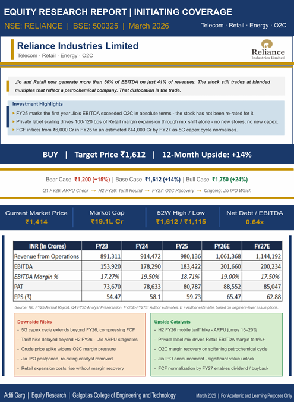

# Reliance_Equity_Research_Report
Reliance trades like an oil company. Jio and Retail now generate over 50% of EBITDA - the stock hasn't moved for it. I wrote a 26-page research report to understand why that gap exists and whether it closes. BUY. Target ₹1,612.

# Reliance Industries — Equity Research Report

Reliance trades like an oil company.
Jio and Retail now generate over 50% of consolidated 
EBITDA. The stock hasn't moved for it.
That's the whole thesis, really.

BUY | Target ₹1,612 | 12-Month Upside: +14%

---

---

## What I Was Actually Trying To Figure Out

The headline numbers looked uninspiring. 7.1% revenue 
growth. 2.9% EBITDA growth. Easy to scroll past.

But then I broke it down by segment and the picture 
changed completely. Jio's EBITDA exceeded O2C for the 
first time in FY25. Retail is being valued at roughly 
half the multiple of DMart despite running at 10x 
the revenue. And O2C — which everyone's worried about 
— is cyclically weak because of Chinese capacity 
overhangs. Not structurally broken. Just temporarily 
ugly, which is exactly when the market misprices things.

Three businesses. Three completely different lifecycle 
stages. One blended multiple that captures none of 
them. That gap doesn't stay forever.

---

## What The Report Gets Into

**Valuation**

SOTP is the only methodology that makes sense here —
a single blended multiple is analytically useless when 
you're dealing with a telecom platform, a consumer 
retailer, and a petrochemical refinery in the same 
P&L. Jio at 15x FY26E EV/EBITDA gives ₹832 per share. 
Retail at 27x gives ₹599. O2C at 6.5x gives ₹264.

DCF cross-check lands at ₹1,150-1,200. Treated as 
a floor. Every multiple I used is conservative relative 
to where actual peers trade — the target shouldn't 
depend on multiple expansion. It should just be what 
the business is worth at what it's already earning.

**Segment by Segment**

Jio's ARPU is ₹206. Airtel's is ₹245. That ₹39 gap 
across 488 million users is roughly ₹22,700 crore 
of annual revenue waiting to happen — on a network 
that's already built and largely depreciated. The 
incremental margin on that revenue is about 40%.

Retail's private label business went from zero to 
₹11,450 crore in two years. Scaling penetration from 
4% to 10-12% drives 100-120 bps of margin expansion 
through pure mix shift. No new stores. No new capex.

O2C's weakness is real but it's a cycle, not a 
collapse. China dumped 78 MMT of new ethylene capacity 
into an already-supplied market. That's the explanation. 
Jamnagar's structural position hasn't changed.

**The Scenarios**

Bear case is ₹1,200 — but it requires Jio ARPU to 
stall and O2C spreads to stay compressed into FY28 
simultaneously. I gave that 20% probability because 
those are largely independent variables. Bad things 
can happen at the same time, but this particular 
combination is a tail scenario.

Base case is ₹1,612 at 55%. Not a forecast of 
something new happening — just visible trends 
continuing for four more quarters.

Bull case is ₹1,750 at 25%. ARPU reaches Airtel 
levels, O2C recovers ahead of schedule, Jio IPO 
gets announced. None of that is implausible. It just 
needs more things going right on a tighter timeline.

Probability-weighted outcome: ₹1,564. Still a BUY.

**Risks — The Ones That Actually Matter**

Russian crude disruption is the one I can't model 
around. A $2/bbl effective cost increase hits EBITDA 
by ₹10,000-13,000 crore and there's no operational 
hedge on the refining side. It's a geopolitical 
variable that sits entirely outside the financial model.

Jio ARPU stagnation is model-sensitive but manageable. 
Every ₹10 of ARPU miss is roughly ₹70-80 per share 
of SOTP. Even in the bear ARPU scenario the target 
compresses to ₹1,520-1,540. Still a BUY.

Leadership concentration is a multiple risk, not an 
earnings risk. It doesn't show up in quarterly EBITDA. 
It shows up in what the market is willing to pay for 
future growth decisions. 2-3 turns of multiple 
compression on Jio alone is ₹150-200 per share. 
Low probability, but worth naming clearly.

---

## The Two Things That Surprised Me

Quick commerce risk to Retail is not really geographic. 
I initially framed it that way — Blinkit and Zepto 
as a metro problem, Tier 2/3 footprint defensible. 
That's technically correct but incomplete. The real 
risk is behavioural. Customers who switch to quick 
commerce for grocery don't move the same basket to 
a faster channel. They make different decisions 
entirely — need-based, item-specific, no browsing. 
Store visits generate impulse purchases and private 
label trials. Quick deliveries generate none of that. 
If urban footfall drops, the margin expansion timeline 
extends. That's the risk I wasn't framing precisely 
enough at the start.

The FCF story also gets misread. ₹6,000 crore in FY25 
looks terrible. But that's ₹1,31,107 crore of capex 
running against ₹1,83,422 crore of EBITDA. The 5G 
rollout is essentially done. Capex normalises toward 
₹1.10-1.15 lakh crore by FY27. FCF crosses into 
meaningfully positive territory at that intersection. 
The fear is already priced in. The recovery isn't.

---

## How I Built This

Financial modelling in Excel — SOTP, DCF, three-scenario 
analysis, sensitivity tables across Jio multiples, 
O2C EBITDA, and Retail margin assumptions.

Primary sources: RIL FY25 Annual Report, Q4 FY25 
Analyst Presentation, Jio Platforms and Bharti Airtel 
quarterly results, IEA Global Hydrogen Review, peer 
company filings from LyondellBasell, DMart, Trent, 
Walmart. FY26E-FY27E figures are author estimates.

Independent academic report. Not investment advice.

---

## Honestly, Who Pushes Back On This

Someone who looks at the 7.1% revenue growth and 
2.9% EBITDA growth and calls it a slow compounder. 
That reading isn't wrong — it's just top-down. 

The moment you go segment by segment, the picture 
changes. Jio growing EBITDA at 16.8%. Retail expanding 
margins. O2C dragging the headline because of a 
China-driven cycle that Jamnagar didn't cause and 
can't control. Reading the consolidated P&L here 
is like averaging a sprinter and a marathon runner 
and concluding neither is particularly fast.

The thesis is testable. Three quarterly datapoints 
in the next 12 months confirm or challenge it. 
That's what makes it a position, not a narrative.

---
## Report Preview(Screenshot/Demo)

Built by Aditi Garg  
Galgotias College of Engineering and Technology  
March 2026  
[LinkedIn](https://www.linkedin.com/in/aditigarg2712/)

*For Academic and Learning Purposes Only*
